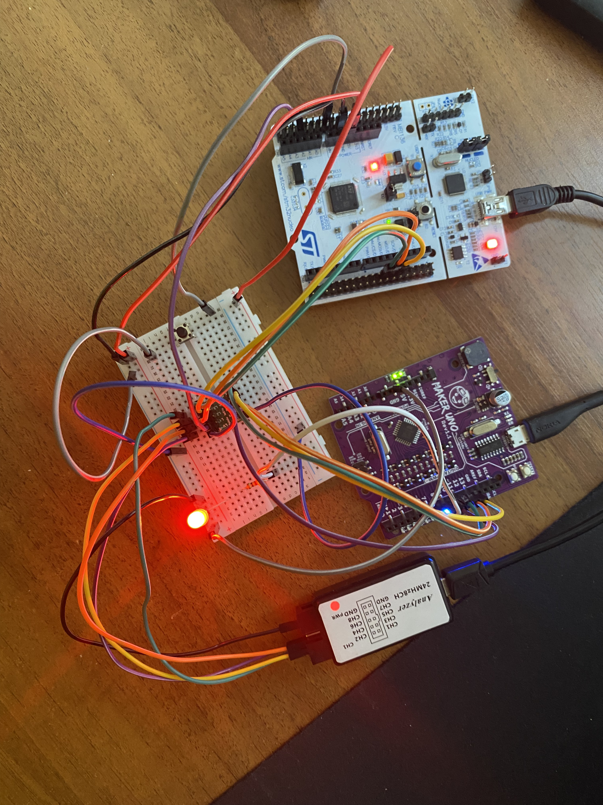
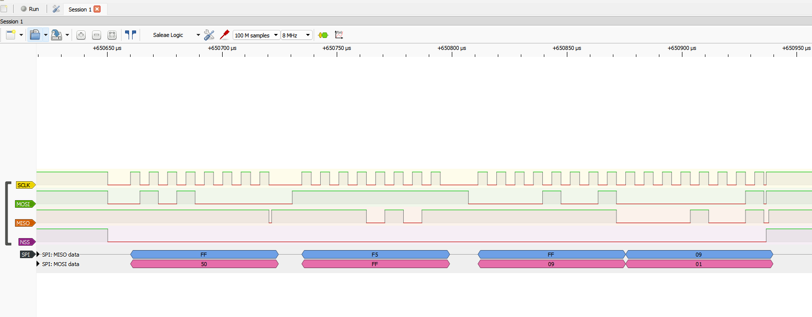
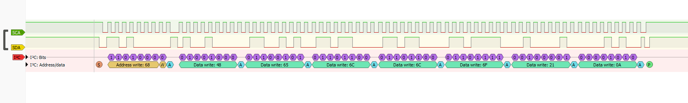

# STM32F4 Bare-Metal Peripheral Drivers

  

## Overview

Custom peripheral drivers for the STM32F411xx microcontroller family, written from scratch in C using Direct Register Access (Bare-Metal). This project completely bypasses the STM32 HAL (Hardware Abstraction Layer) library to demonstrate a deep understanding of the ARM Cortex-M4 architecture, memory-mapped peripherals, and low-level hardware control.

## Disclaimer & Credits

The foundational architecture and theoretical background for these drivers were inspired by the **"Mastering Microcontroller" (MCU1) course by FastBit Embedded Brain Academy**. I have expanded upon the course materials by verifying the protocols on the physical layer and implementing custom hardware integration tests to ensure real-world applicability.

## Hardware Setup

  

* **Microcontroller:** STM32F411RET6 (Nucleo-F411RE Board)
* **Core:** ARM Cortex-M4 with FPU
* **External Hardware:** Arduino UNO (Slave or Master), Logic Analyzer (Saleae clone), 3.3V-to-5V bidirectional level shifter.

## Implemented Features & Hardware Verification

### 1. SPI (Serial Peripheral Interface)

Implemented blocking and interrupt-based communication modes. Master-Slave communication was successfully established between the STM32 and Arduino UNO.

*Hardware verification using a logic analyzer:*

### 2. I2C (Inter-Integrated Circuit)

Configured for standard and fast modes with hardware event and error interrupt handling (TXE, RXNE, ACK failure). Tested by reading/writing data from external slave devices.

*Hardware verification using a logic analyzer:*

### 3. GPIO (General Purpose Input/Output)

Full pin configuration (Mode, Speed, Pull-up/Pull-down, Output Type) and external interrupt handling via EXTI line mapping.

### 4. USART (Universal Synchronous/Asynchronous Receiver Transmitter)

*Basic register configuration in progress.*

## Usage Examples

Please refer to the `/Examples` and `/Src` directories for complete `main.c` setups demonstrating how to initialize the peripherals and handle IRQ callbacks.
